<!-- Generated by GitHub Profile Agent Console. Edit profile.config.json, then run npm run generate. -->

  <picture>
    <source media="(max-width: 760px) and (prefers-color-scheme: dark)" srcset="./assets/hero/agent-console-bce841e0-mobile-dark.svg">
    <source media="(max-width: 760px)" srcset="./assets/hero/agent-console-bce841e0-mobile-light.svg">
    <source media="(prefers-color-scheme: dark)" srcset="./assets/hero/agent-console-bce841e0-dark.svg">
    <source media="(prefers-color-scheme: light)" srcset="./assets/hero/agent-console-bce841e0-light.svg">
    
  </picture>

  
  
  
  

## About Me

I am an undergraduate student at Politeknik Astra with a strong interest in artificial intelligence, full-stack web development, and mobile application development.

I enjoy turning ideas into practical digital products while strengthening my foundations in software engineering, data, and intelligent systems. My long-term goal is to grow into an AI Engineer who builds reliable and useful technology.

## Current Focus

| Area | What I am exploring |
| --- | --- |
| **Web Applications** | Building responsive full-stack products with maintainable interfaces, APIs, authentication, and data flows. |
| **Mobile Applications** | Creating practical cross-platform mobile experiences with React Native and a product-focused approach. |
| **Artificial Intelligence** | Strengthening the data, programming, and software foundations required to grow into an AI Engineer. |

## AI Engineering Direction

I am developing strong full-stack and mobile engineering foundations while progressively exploring artificial intelligence. My direction is to connect reliable software engineering, structured data, and AI capabilities to create practical systems with real user value.

## Languages & Toolkit

| Category | Technologies |
| --- | --- |
| **Languages** | `TypeScript` · `JavaScript` · `SQL` |
| **Frontend** | `React` · `React Native` · `Next.js` · `Tailwind CSS` |
| **Backend** | `Node.js` · `NextAuth` · `Prisma` |
| **Databases** | `PostgreSQL` · `SQL Server` |
| **Tools** | `Git` · `GitHub Actions` · `Automation` |

  <picture>
    <source media="(prefers-color-scheme: dark)" srcset="https://github-readme-stats.vercel.app/api/top-langs/?username=gumelarakhirul&layout=compact&hide_border=true&theme=github_dark&langs_count=10">
    <source media="(prefers-color-scheme: light)" srcset="https://github-readme-stats.vercel.app/api/top-langs/?username=gumelarakhirul&layout=compact&hide_border=true&langs_count=10">
    
  </picture>

## Recent Activity

<!-- AUTO:ACTIVITY:START -->
_Recent public activity will appear here after the workflow runs._
<!-- AUTO:ACTIVITY:END -->

## Contribution Activity

  

  <picture>
    <source media="(prefers-color-scheme: dark)" srcset="https://raw.githubusercontent.com/gumelarakhirul/gumelarakhirul/output/github-contribution-grid-snake-dark.svg">
    <source media="(prefers-color-scheme: light)" srcset="https://raw.githubusercontent.com/gumelarakhirul/gumelarakhirul/output/github-contribution-grid-snake.svg">
    
  </picture>

---

  Learning deeply, building consistently, and growing toward intelligent systems.

